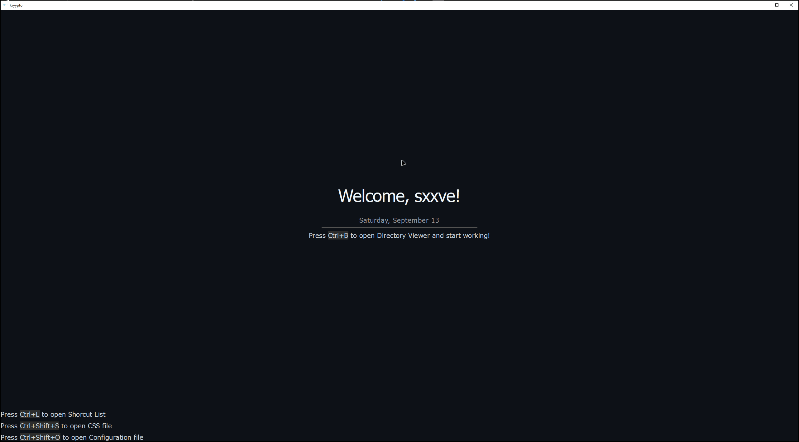

# Kryypto ⌨️​

A lightweight, fully keyboard-supported python text editor with deep customization and GitHub integration.

## Linux version coming soon...


## ScreenShots 📸


## Kryypto Demo



## ✨ Features

- Lightweight – minimal overhead
- Full Keyboard Support – no need for the mouse, every feature is accessible via hotkeys
- Discord presence
- Live MarkDown Preview
- Session Restore
- Custom Styling
  - `config\configuration.cfg` for editor settings
  - CSS for theme and style customization
- Editing Tools
  - Find text in file
  - Jump to line
  - Adjustable cursor (color & width)
  - Configurable animations (types & duration)

- Git & GitHub Integration
  - View total commits
  - See last commit message & date
  - Track file changes directly inside the editor
- Productivity Features
  - Autocompleter
  - Builtin Terminal
  - Docstring panel (hover to see function/class docstring)
  - Tab-based file switching
  - Bookmarking lines
  - Custom title bar
- Syntax Highlighting for
  - Python
  - CSS
  - HTML
  - JSON
  - Config files
  - Markdown
  - Bash
  -Dockerfile

## 🚀 Getting Started


you got two options:

1. Install binary file from the releases

2. Clone the repository:
   ```bash
   git clone git@github.com:NaturalCapsule/Kryypto.git
   pip install -r requirements.txt
   cd Kryypto/src
   kryypto.py
  ```

> [!WARNING]
> This project is under development. You might face lagging when loading large files or syntax highlighting missmatch, etc.

## License

This project is licensed under [License](LICENSE.txt).