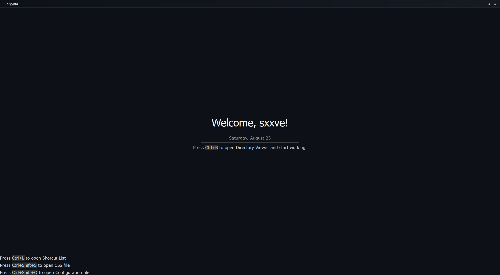
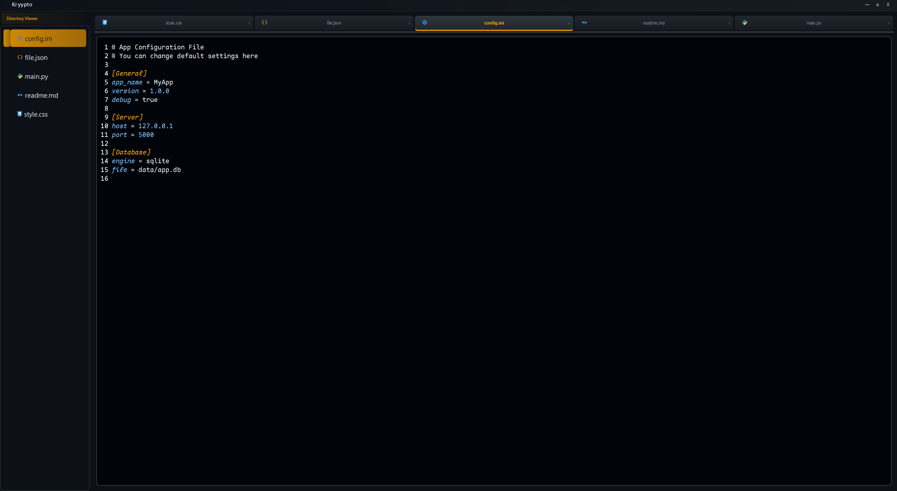
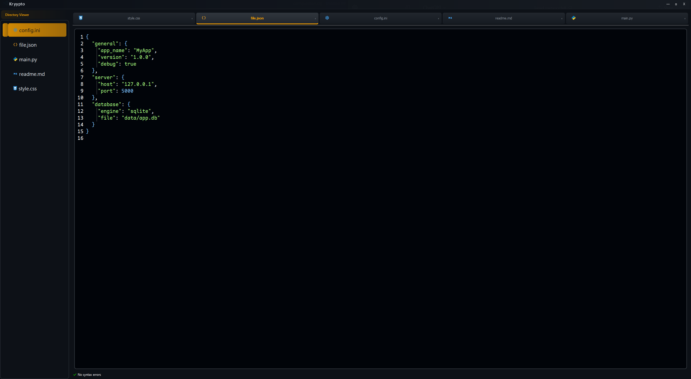
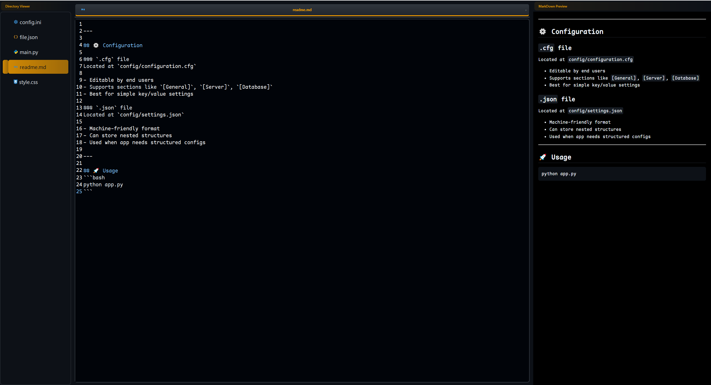
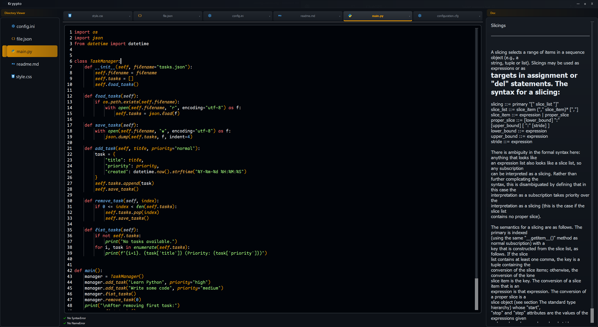
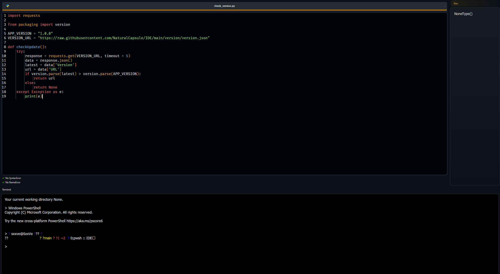
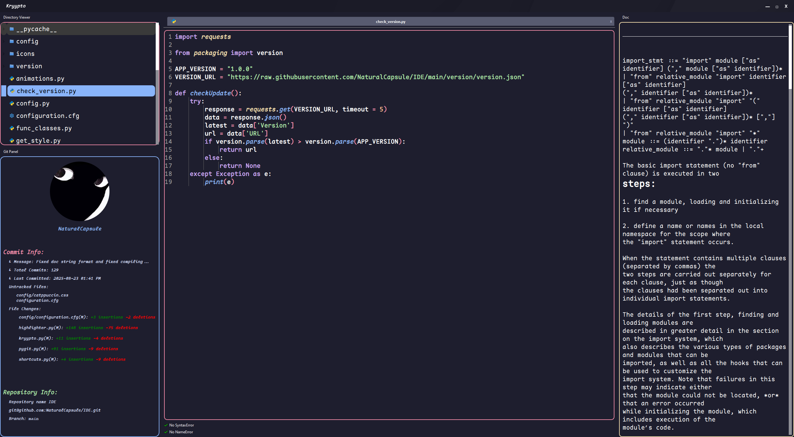
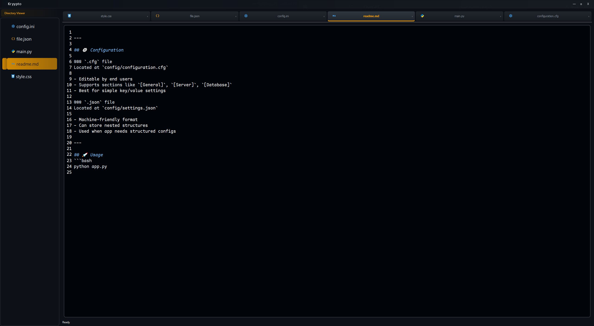

# Kryypto ⌨️​

A lightweight, fully keyboard-supported python text editor with deep customization and GitHub integration.

## ScreenShots 📸








## ✨ Features

- Lightweight – minimal overhead
- Full Keyboard Support – no need for the mouse, every feature is accessible via hotkeys
- Discord presence
- Live MarkDown Preview
- Session Restore
- Custom Styling
  - `config\configuration.cfg` for editor settings
  - CSS for theme and style customization
- Editing Tools
  - Find text in file
  - Jump to line
  - Adjustable cursor (color & width)
  - Configurable animations (types & duration)

- Git & GitHub Integration
  - View total commits
  - See last commit message & date
  - Track file changes directly inside the editor
- Productivity Features
  - Autocompleter
  - Builtin Terminal
  - Docstring panel (hover to see function/class docstring)
  - Tab-based file switching
  - Bookmarking lines
  - Custom title bar
- Syntax Highlighting for
  - Python
  - CSS
  - JSON
  - Config files
  - Markdown
  
## 🚀 Getting Started

you got two options:

1. Install binary file from the releases

2. Clone the repository:
   ```bash
   git clone git@github.com:NaturalCapsule/Kryypto.git
   cd kryypto
   pip install -r requirements.txt
   kryypto.py


> [!WARNING]
> This project is under development. You might face lagging when loading large files or syntax highlighting missmatch, etc.


> [!WARNING]
> ~~you might face a git error when you launch Kryypto, you can solve it by installing and setting up git or open CMD and type: set GIT_PYTHON_REFRESH=quiet~~


## License

This project is licensed under [License](LICENSE.txt).

<!-- 
## Kurdish

بەرنامەیەکی کێش سووک، بە تەواوی پشتگیریKeyboard دەکات بە شێوازی جۆراو جۆر لەگەڵ GitHub.

## ڕەسمەکان 📸 .





- تایبەتمەندیەکان
  - کێش سووک
  - بەتەواوی پشتگیری Keyboard  دەکات و پێوست بەبەکار هێنانی Mouse ناکات


- دەسکاری جۆراو جۆر
  - `config\configuration.cfg` بۆ سێتینگی بەرنامەکە
  -  `config\style.css` بۆ گۆرینی شێوەکەی

- ئامێرەکانی دەستکاری کردن
   - دۆزینەوەی ڕستە یان وشە لە File
دەستکاری کردنی Cursor ڕەنگ و پانی
دەسکاری Animation بە جۆری جیاواز و ماوەی

Git و GitHub
  - سەیرکردنی ژمارەی نامەکان
  - سەیرکردنی کۆتا نامەو کاتەکەی
  - سەیرکردنی فایلە گۆڕاوەکان

- تایبەت مەندی چالاکی
  - Auto Completer
  - Docstring
  - Terminal
  - گۆرینی فایلەکان

- بۆ ڕونکردنەوەی Syntax
  - Python
  - CSS
  - JSON
  - فایلەکانی Config
  - Markdown

## 🚀 دەستپێکردن

دوو هەڵبژاردن هەیە:

1. ڕێپۆزیتۆری کلۆن بکە:
   ```bash
   git clone git@github.com:NaturalCapsule/Kryypto.git
   cd kryypto
   pip install -r requirements.txt
   kryypto.py

2. دابەزاندنی exe لە release


> [!WARNING]
> ئەم پڕۆژەیە لە کارکردنایا، لەوانەیە بەرنامەکە خاو ببێتەوە لە کاتی کردنەوەی فایلی گەورە یان Syntax highlighting mismatch.


> [!WARNING]
> ~~لەوانەیە کە یەکەم جار بەرنامەکە بکەیتەوە git ئیرۆر بات دەتوانیت چاکی بکەیت بە دابەزاندنی git و ڕێکی خەیت یان CMD کەیتەوە و بنوسیت: set GIT_PYTHON_REFRESH=quiet~~ -->